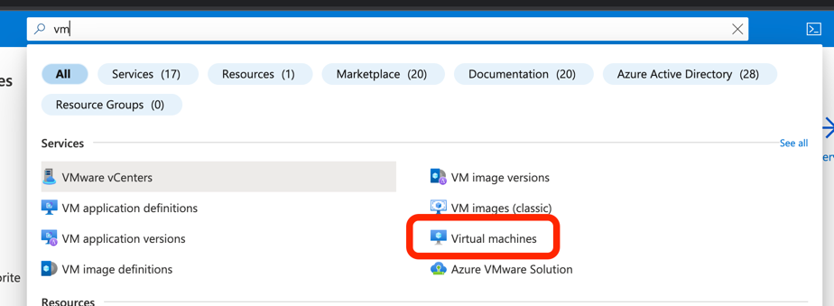
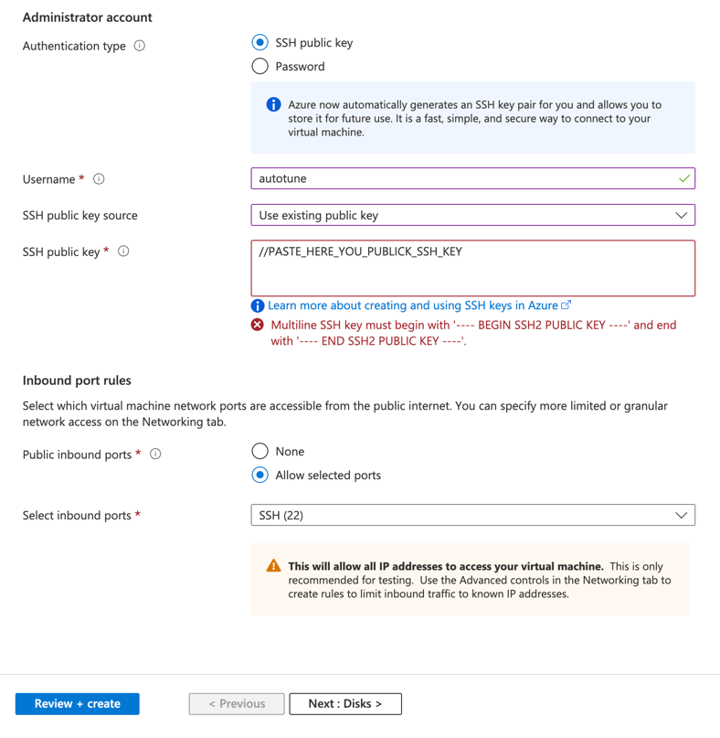

# AutotuneWeb

**[Run AutotuneWeb Now](https://autotuneweb.azurewebsites.net)**

This project aims to simplify the process of running [Autotune](https://openaps.readthedocs.io/en/latest/docs/Customize-Iterate/autotune.html)
for non-OpenAPS users, e.g. people running [AndroidAPS](http://androidaps.readthedocs.io/en/latest/EN/index.html).

There are two main steps in the project:

1. Converting a profile (basal rates, IC and CR values) from [Nightscout](http://www.nightscout.info/) into a format ready to be used with Autotune, and
2. Optionally, automatically running Autotune on the converted profile and emailing the results back once complete

To implement this there are several resources required. This has been designed to run in Azure but could be adapted to run elsewhere:

1. Website to receive user input and convert Nightscout profile to OpenAPS format
2. Linux VM image with Autotune installed ready to run
3. Azure Storage account to hold the Autotune input and output files
4. Azure Batch account to execute the Autotune jobs on a VM instance
5. [SendGrid](https://sendgrid.com/) account to send the Autotune results by email

### Before start you should have account in Azure, that able to:
1) Create VM 
2) Create storage account
3) Create batch account, that has the ability to increase limits
4) Create simple app service for asp.net 


## First step - create VM image setup with Autotune
1) In Azure search bar type `vm` and select `virtual machine`  
    

2) In open window select `create` and after `Azure virtual machine`
     

3) Then you need to fill in the fields with an asterisk, an example in the pictures below
    - If you don't have any Resources group, it's need create one, click to `Create new`
     
   

4) Then click `Review + create` and after validate, click one more `create`


In Azure, create a new Linux VM. Once the VM is provisioned, install Autotune using the standard installation instructions. In my case I followed the instructions
to install the latest dev version.

Once Autotune is installed on your VM, create an image of that VM. This image will be used later to dynamically create VMs as needed to process Autotune jobs. The
[instructions for how to create an image from a VM](https://docs.microsoft.com/en-us/azure/virtual-machines/linux/capture-image) can be found on the Azure
documentation site.


## Azure Storage Accout setup

In Azure, create a new storage account. You should select a general purpose v2 account type. There's no further configuration of the storage account required.

## Azure Batch Account setup

In Azure, create a new batch account. This is going to manage the actual execution of the Autotune jobs. When creating the account, select to use the storage account
you have just created.

Within the batch account, create a new pool. This is going to manage the individual VMs that Autotune is going to run on. You want this to use the VM image with
Autotune installed on that you created earlier, so change the Image Type to Custom and select your VM image.

Crucially, you want the pool to automatically scale up and down to handle the Autotune jobs that need to be run. I have set this up to use low-priority VMs to
reduce costs using the following formula:

```
// Get pending tasks for the past 5 minutes.
$samples = $ActiveTasks.GetSamplePercent(TimeInterval_Minute * 5);

// If we have fewer than 70 percent data points, we use the last sample point, otherwise we use the maximum of last sample point and the history average.
$tasks = $samples < 70 ? max(0, $ActiveTasks.GetSample(1)) : 
max( $ActiveTasks.GetSample(1), avg($ActiveTasks.GetSample(TimeInterval_Minute * 5)));

// If number of pending tasks is not 0, set targetVM to pending tasks, otherwise half of current dedicated.
$targetVMs = $tasks > 0 ? max(1, $tasks) : max(0, $TargetLowPriorityNodes / 2);

// The pool size is capped at 20, if target VM value is more than that, set it to 20. This value should be adjusted according to your use case.
cappedPoolSize = 20;
$TargetLowPriorityNodes = max(0, min($targetVMs, cappedPoolSize));

// Set node deallocation mode - keep nodes active only until tasks finish
$NodeDeallocationOption = taskcompletion;
```

## Website Setup

Create an Azure App Service and deploy the AutotuneWeb project to it.

In the App Service configuration, go to the `Application settings` option and add connection strings with the following details:

| Name    | Value                                              | Type     |
|---------|----------------------------------------------------|----------|
| Storage | (Connection string for your Azure Storage account) | Custom   |

Also add the following application settings:

| Name                | Value                                                                          |
|---------------------|--------------------------------------------------------------------------------|
| BatchAccountUrl     | The URL of your Azure Batch account                                            |
| BatchAccountName    | The name of your Azure Batch account                                           |
| BatchAccountKey     | One of the keys for your Azure Batch account                                   |
| BatchPoolId         | The name of your Azure Batch pool                                              |
| SendGridApiKey      | The API Key for your SendGrid account                                          |
| SendGridFromAddress | The email address to use as the From address on your emails                    |
| ResultsCallbackKey  | A random value to use to ensure that only your batch jobs can send you results |